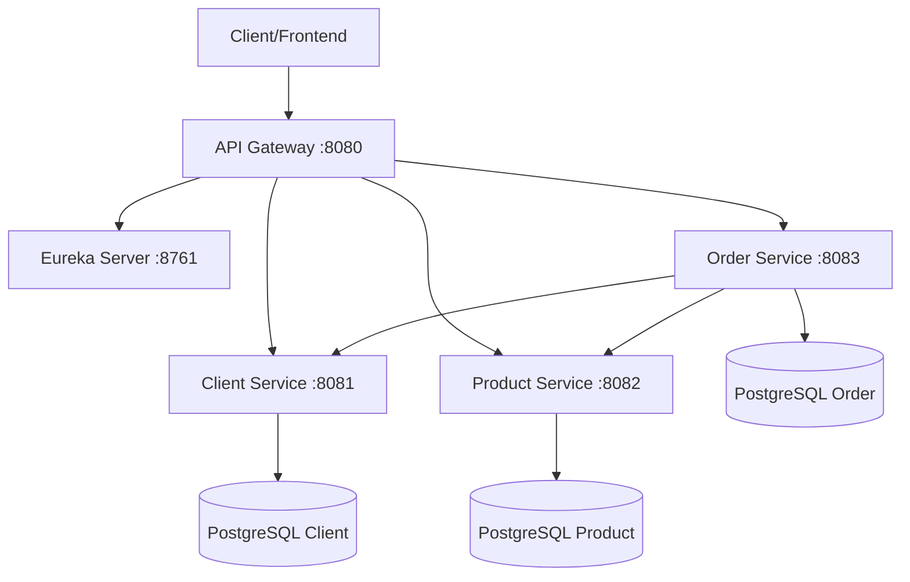

# 🎯 Projet Microservices - Service de Gestion de Commandes

## 📋 Prérequis et Technologies

### Technologies Requises
- **Java 17+**
- **Spring Boot 3.x**
- **Spring Cloud 2023.x**
- **PostgreSQL 15+**
- **Maven 3.8+**
- **Docker & Docker Compose**
- **Postman** (pour tester les APIs)

### Dépendances Spring Boot
```xml
<!-- Spring Boot Starters -->
spring-boot-starter-web
spring-boot-starter-data-jpa
spring-boot-starter-validation
spring-boot-starter-actuator

<!-- Spring Cloud -->
spring-cloud-starter-openfeign
spring-cloud-starter-netflix-eureka-client
spring-cloud-starter-gateway

<!-- Base de données -->
postgresql
h2database (pour tests)

<!-- Documentation API -->
springdoc-openapi-starter-webmvc-ui

<!-- Tests -->
spring-boot-starter-test
testcontainers-postgresql
```

## 🏗️ Architecture du Projet

### Structure Globale
```
order-management-system/
├── eureka-server/              # Service Registry
├── api-gateway/                # API Gateway
├── client-service/             # Service Client
├── product-service/            # Service Produit
├── order-service/              # Service Commande
├── docker-compose.yml          # Orchestration des services
└── README.md
```

### Architecture Microservices



## 🗂️ Structure Détaillée par Service

### 1. Eureka Server (Port 8761)
```
eureka-server/
├── src/
│   └── main/
│       ├── java/
│       │   └── com/orderms/eureka/
│       │       └── EurekaServerApplication.java
│       └── resources/
│           └── application.yml
├── pom.xml
└── Dockerfile
```

### 2. API Gateway (Port 8080)
```
api-gateway/
├── src/
│   └── main/
│       ├── java/
│       │   └── com/orderms/gateway/
│       │       ├── GatewayApplication.java
│       │       └── config/
│       │           └── GatewayConfig.java
│       └── resources/
│           └── application.yml
├── pom.xml
└── Dockerfile
```

### 3. Client Service (Port 8081)
```
client-service/
├── src/
│   ├── main/
│   │   ├── java/
│   │   │   └── com/orderms/client/
│   │   │       ├── ClientServiceApplication.java
│   │   │       ├── controller/
│   │   │       │   └── ClientController.java
│   │   │       ├── service/
│   │   │       │   ├── ClientService.java
│   │   │       │   └── impl/
│   │   │       │       └── ClientServiceImpl.java
│   │   │       ├── repository/
│   │   │       │   └── ClientRepository.java
│   │   │       ├── entity/
│   │   │       │   └── Client.java
│   │   │       ├── dto/
│   │   │       │   ├── ClientDTO.java
│   │   │       │   ├── ClientCreateDTO.java
│   │   │       │   └── ClientUpdateDTO.java
│   │   │       ├── mapper/
│   │   │       │   └── ClientMapper.java
│   │   │       ├── exception/
│   │   │       │   ├── ClientNotFoundException.java
│   │   │       │   └── GlobalExceptionHandler.java
│   │   │       └── config/
│   │   │           └── DatabaseConfig.java
│   │   └── resources/
│   │       ├── application.yml
│   │       └── db/migration/
│   │           └── V1__Create_client_table.sql
│   └── test/
│       └── java/
│           └── com/orderms/client/
│               ├── controller/
│               │   └── ClientControllerTest.java
│               ├── service/
│               │   └── ClientServiceTest.java
│               └── repository/
│                   └── ClientRepositoryTest.java
├── pom.xml
└── Dockerfile
```

### 4. Product Service (Port 8082)
```
product-service/
├── src/
│   ├── main/
│   │   ├── java/
│   │   │   └── com/orderms/product/
│   │   │       ├── ProductServiceApplication.java
│   │   │       ├── controller/
│   │   │       │   └── ProductController.java
│   │   │       ├── service/
│   │   │       │   ├── ProductService.java
│   │   │       │   └── impl/
│   │   │       │       └── ProductServiceImpl.java
│   │   │       ├── repository/
│   │   │       │   └── ProductRepository.java
│   │   │       ├── entity/
│   │   │       │   └── Product.java
│   │   │       ├── dto/
│   │   │       │   ├── ProductDTO.java
│   │   │       │   ├── ProductCreateDTO.java
│   │   │       │   └── ProductUpdateDTO.java
│   │   │       ├── mapper/
│   │   │       │   └── ProductMapper.java
│   │   │       ├── exception/
│   │   │       │   ├── ProductNotFoundException.java
│   │   │       │   ├── InsufficientStockException.java
│   │   │       │   └── GlobalExceptionHandler.java
│   │   │       └── config/
│   │   │           └── DatabaseConfig.java
│   │   └── resources/
│   │       ├── application.yml
│   │       └── db/migration/
│   │           └── V1__Create_product_table.sql
│   └── test/
│       └── java/
│           └── com/orderms/product/
│               ├── controller/
│               │   └── ProductControllerTest.java
│               ├── service/
│               │   └── ProductServiceTest.java
│               └── repository/
│                   └── ProductRepositoryTest.java
├── pom.xml
└── Dockerfile
```

### 5. Order Service (Port 8083)
```
order-service/
├── src/
│   ├── main/
│   │   ├── java/
│   │   │   └── com/orderms/order/
│   │   │       ├── OrderServiceApplication.java
│   │   │       ├── controller/
│   │   │       │   └── OrderController.java
│   │   │       ├── service/
│   │   │       │   ├── OrderService.java
│   │   │       │   └── impl/
│   │   │       │       └── OrderServiceImpl.java
│   │   │       ├── repository/
│   │   │       │   ├── OrderRepository.java
│   │   │       │   └── OrderItemRepository.java
│   │   │       ├── entity/
│   │   │       │   ├── Order.java
│   │   │       │   └── OrderItem.java
│   │   │       ├── dto/
│   │   │       │   ├── OrderDTO.java
│   │   │       │   ├── OrderCreateDTO.java
│   │   │       │   ├── OrderItemDTO.java
│   │   │       │   ├── ClientDTO.java (pour Feign)
│   │   │       │   └── ProductDTO.java (pour Feign)
│   │   │       ├── mapper/
│   │   │       │   └── OrderMapper.java
│   │   │       ├── client/
│   │   │       │   ├── ClientServiceClient.java
│   │   │       │   └── ProductServiceClient.java
│   │   │       ├── exception/
│   │   │       │   ├── OrderNotFoundException.java
│   │   │       │   ├── ClientNotValidException.java
│   │   │       │   ├── ProductNotValidException.java
│   │   │       │   └── GlobalExceptionHandler.java
│   │   │       └── config/
│   │   │           ├── DatabaseConfig.java
│   │   │           └── FeignConfig.java
│   │   └── resources/
│   │       ├── application.yml
│   │       └── db/migration/
│   │           ├── V1__Create_order_table.sql
│   │           └── V2__Create_order_item_table.sql
│   └── test/
│       └── java/
│           └── com/orderms/order/
│               ├── controller/
│               │   └── OrderControllerTest.java
│               ├── service/
│               │   └── OrderServiceTest.java
│               ├── repository/
│               │   └── OrderRepositoryTest.java
│               └── client/
│                   ├── ClientServiceClientTest.java
│                   └── ProductServiceClientTest.java
├── pom.xml
└── Dockerfile
```

## 📋 Liste des Fichiers à Créer

### Fichiers Communs
- **docker-compose.yml** (orchestration complète)
- **README.md** (documentation du projet)
- **.gitignore**

### Eureka Server (5 fichiers)
1. `EurekaServerApplication.java`
2. `application.yml`
3. `pom.xml`
4. `Dockerfile`
5. `.gitignore`

### API Gateway (6 fichiers)
1. `GatewayApplication.java`
2. `GatewayConfig.java`
3. `application.yml`
4. `pom.xml`
5. `Dockerfile`
6. `.gitignore`

### Client Service (18 fichiers)
1. `ClientServiceApplication.java`
2. `ClientController.java`
3. `ClientService.java`
4. `ClientServiceImpl.java`
5. `ClientRepository.java`
6. `Client.java`
7. `ClientDTO.java`
8. `ClientCreateDTO.java`
9. `ClientUpdateDTO.java`
10. `ClientMapper.java`
11. `ClientNotFoundException.java`
12. `GlobalExceptionHandler.java`
13. `DatabaseConfig.java`
14. `application.yml`
15. `V1__Create_client_table.sql`
16. `ClientControllerTest.java`
17. `pom.xml`
18. `Dockerfile`

### Product Service (19 fichiers)
1. `ProductServiceApplication.java`
2. `ProductController.java`
3. `ProductService.java`
4. `ProductServiceImpl.java`
5. `ProductRepository.java`
6. `Product.java`
7. `ProductDTO.java`
8. `ProductCreateDTO.java`
9. `ProductUpdateDTO.java`
10. `ProductMapper.java`
11. `ProductNotFoundException.java`
12. `InsufficientStockException.java`
13. `GlobalExceptionHandler.java`
14. `DatabaseConfig.java`
15. `application.yml`
16. `V1__Create_product_table.sql`
17. `ProductControllerTest.java`
18. `pom.xml`
19. `Dockerfile`

### Order Service (25 fichiers)
1. `OrderServiceApplication.java`
2. `OrderController.java`
3. `OrderService.java`
4. `OrderServiceImpl.java`
5. `OrderRepository.java`
6. `OrderItemRepository.java`
7. `Order.java`
8. `OrderItem.java`
9. `OrderDTO.java`
10. `OrderCreateDTO.java`
11. `OrderItemDTO.java`
12. `ClientDTO.java`
13. `ProductDTO.java`
14. `OrderMapper.java`
15. `ClientServiceClient.java`
16. `ProductServiceClient.java`
17. `OrderNotFoundException.java`
18. `ClientNotValidException.java`
19. `ProductNotValidException.java`
20. `GlobalExceptionHandler.java`
21. `DatabaseConfig.java`
22. `FeignConfig.java`
23. `application.yml`
24. `V1__Create_order_table.sql`
25. `V2__Create_order_item_table.sql`
26. `OrderControllerTest.java`
27. `pom.xml`
28. `Dockerfile`

## 🔗 Relations entre Entités

### Client
```java
@Entity
public class Client {
    @Id @GeneratedValue
    private Long id;
    private String nom;
    private String email;
    private String telephone;
    private String adresse;
    private LocalDateTime dateCreation;
}
```

### Product
```java
@Entity
public class Product {
    @Id @GeneratedValue
    private Long id;
    private String nom;
    private String description;
    private BigDecimal prix;
    private Integer quantiteStock;
    private String categorie;
}
```

### Order & OrderItem
```java
@Entity
public class Order {
    @Id @GeneratedValue
    private Long id;
    private Long clientId; // référence vers Client Service
    private LocalDateTime dateCommande;
    private BigDecimal montantTotal;
    private String statut;

    @OneToMany(mappedBy = "order", cascade = CascadeType.ALL)
    private List<OrderItem> items;
}

@Entity
public class OrderItem {
    @Id @GeneratedValue
    private Long id;
    private Long productId; // référence vers Product Service
    private Integer quantite;
    private BigDecimal prixUnitaire;

    @ManyToOne
    private Order order;
}
```

## 🚀 Ordre de Démarrage

1. **Eureka Server** (port 8761)
2. **API Gateway** (port 8080)
3. **Client Service** (port 8081)
4. **Product Service** (port 8082)
5. **Order Service** (port 8083)

## 📚 APIs Principales

### Client Service
- `GET /api/clients` - Liste des clients
- `GET /api/clients/{id}` - Client par ID
- `POST /api/clients` - Créer client
- `PUT /api/clients/{id}` - Modifier client
- `DELETE /api/clients/{id}` - Supprimer client

### Product Service
- `GET /api/products` - Liste des produits
- `GET /api/products/{id}` - Produit par ID
- `POST /api/products` - Créer produit
- `PUT /api/products/{id}` - Modifier produit
- `DELETE /api/products/{id}` - Supprimer produit
- `PUT /api/products/{id}/stock` - Mettre à jour stock

### Order Service
- `GET /api/orders` - Liste des commandes
- `GET /api/orders/{id}` - Commande par ID
- `POST /api/orders` - Créer commande
- `PUT /api/orders/{id}/status` - Changer statut
- `GET /api/orders/client/{clientId}` - Commandes d'un client

## 🧪 Tests

### Types de tests à implémenter
- **Tests unitaires** : Service layer
- **Tests d'intégration** : Repository layer
- **Tests de contrôleur** : Controller layer
- **Tests Feign Client** : Communication inter-services

**Total estimé : ~75 fichiers à créer**
